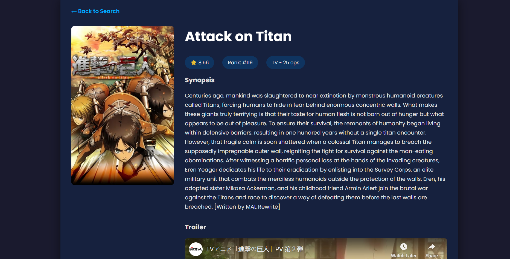

# Anime Universe 🚀

Anime Universe is a dynamic web application for discovering and exploring anime. Powered by the Jikan API, it allows users to search for their favorite series or browse top-airing shows, with a dedicated page for in-depth details, including an embedded trailer.

### ✨ Live Demo

https://anime-api-ten-beta.vercel.app/

---

### 📸 Screenshots

*Homepage showing top airing anime.*





---

### Features

* **Dynamic Homepage**: Displays the top airing anime on the initial page load, providing immediate content instead of a blank screen.
* **Powerful Search**: Find any anime using the real-time search functionality.
* **Detailed Views**: Click on any anime to see a dedicated page with its synopsis, score, rank, episode count, and an embedded trailer.
* **Modern & Responsive Design**: A sleek, mobile-friendly interface built with a dark theme that's easy on the eyes.

---

### 🛠️ Tech Stack

* **Backend**: Node.js, Express.js
* **Frontend**: EJS (Embedded JavaScript) for server-side rendering
* **API**: [Jikan API v4](https://docs.api.jikan.moe/)
* **Deployment**: Vercel

---

### Getting Started

Follow these instructions to get a copy of the project up and running on your local machine for development and testing purposes.

#### Prerequisites

* Node.js and npm installed on your machine.

#### Installation & Setup

1.  **Clone the repository:**
    ```bash
    git clone [https://github.com/your-username/animeAPIproject.git](https://github.com/mirdanish6594/animeAPIproject.git)
    ```

2.  **Navigate to the project directory:**
    ```bash
    cd animeAPIproject
    ```

3.  **Install NPM dependencies:**
    ```bash
    npm install
    ```

4.  **Run the development server:**
    ```bash
    npm run dev
    ```
    The application will be available at `http://localhost:3000`. The server uses `nodemon` to automatically restart upon file changes.

---

### 🚀 Deployment

This project is configured for seamless deployment with Vercel.

1.  **Install the Vercel CLI:**
    ```bash
    npm install -g vercel
    ```

2.  **Deploy to production:**
    ```bash
    vercel --prod
    ```
    Vercel will automatically detect the configuration and deploy your application.

---

### 🙏 Acknowledgement

This project relies on the free and incredible [Jikan API](https://jikan.moe/) for all anime data.
